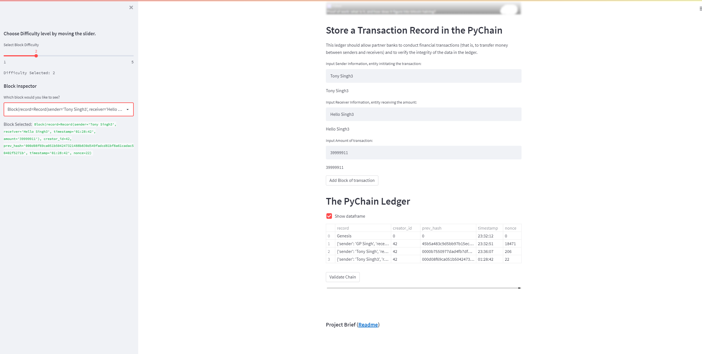

## PyChain Ledger

Blockchain is a type of  distributed ledger to hold transactions occuring between two entities and has key unique features attributed to it. One of them is that there is no need of third party arbitirer for completing the transaction.
Blockchain implementation use different kind of consensus mechanisims to verify the transactions, one of them is Proof of Work.

*\[PoW\]*

![./IMG/POW.PNG]

[Proof of work (PoW)](https://cointelegraph.com/blockchain-for-beginners/proof-of-stake-vs-proof-of-work:-differences-explained) is a form of adding new blocks of transactions to a cryptocurrency's blockchain. The work, in this case, is generating a hash (a long string of characters) that matches the target hash for the current block.

![./IMG/POF.PNG]

One of the algorithims as mentioned by Satoshi N. is hashcash algorithm which has been used in spam filtering and other areas.
![./IMG/hashalgo.PNG]

We will be using hashlib library to imitate the same.In addition we will be developing a web app using streamlit to simulate a Single node block chain transaction simulation.

![./IMG/single.PNG]

Web application allows to define a Sender, receiver and the amount of transaction to be done, uses the selected difficulty level to simulate proof of work and then also validate if the transaction is valid and not correupted by a hacker.
The final app looks like this,
![./IMG/Final.PNG]

()
